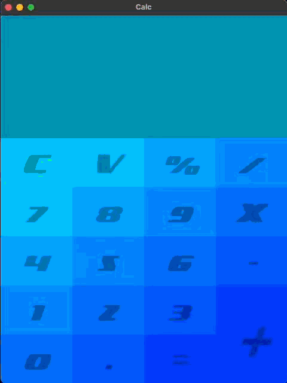

# Calculadora mais bonita do mundo
## Descrição
Essa calculadora foi um dos meus primeiros projetos feito em python, usando a biblioteca Kivy

Criada nos primordios da minha jornada de programação

Ela era capaz de utilizar toda a memoria RAM dos computadores da faculdade, mas era bonita

